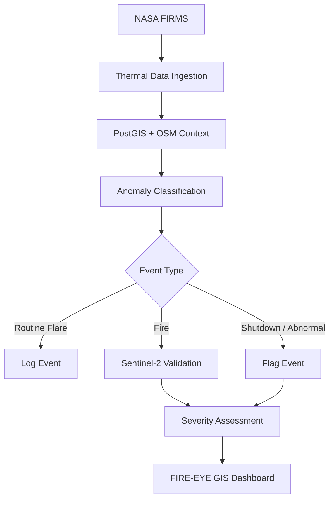

# FIRE-EYE Workflow

This document outlines the real execution workflow of the FIRE-EYE platform.

## Step 1 — Thermal Data Ingestion

NASA FIRMS (Fire Information for Resource Management System) and sensors like VIIRS / MODIS provide near-real-time thermal detections. These raw thermal anomaly points are continuously fetched and ingested into the system.

## Step 2 — Industrial Context

The ingested thermal coordinates are matched against known industrial polygons sourced from OpenStreetMap. This process uses PostGIS spatial matching to provide immediate context about the location of the anomaly (e.g., whether it falls within the boundaries of a refinery, factory, or power plant).

## Step 3 — Anomaly Classification

The system evaluates the thermal characteristics of the event against historical baselines using XGBoost and Isolation Forest models. Based on the pattern of thermal intensity and frequency, the event is classified into one of three categories:
- Routine Flare
- Fire
- Shutdown / abnormal condition

## Step 4 — Satellite Validation

For critical events (like a classified Fire), Sentinel-2 optical and SWIR (Short-Wave Infrared) satellite imagery is queried to provide visual validation of the fire core and surrounding conditions.

## Step 5 — Alerting

The fully enriched event data—including exact coordinates, severity assessment, classification type, and industrial site context—is broadcasted to the tactical FIRE-EYE GIS Dashboard to alert operators for immediate investigation.

---

### Pipeline Visualization

